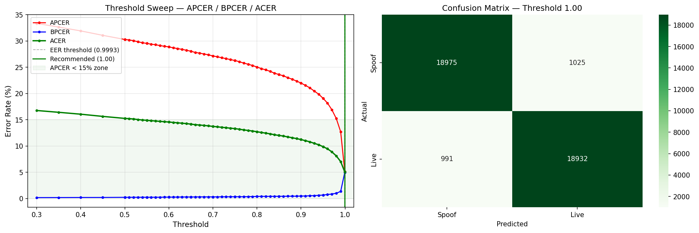
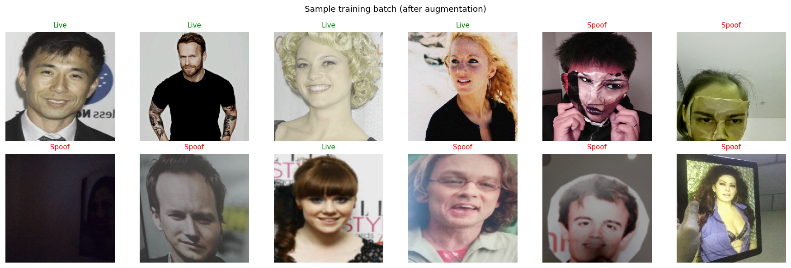
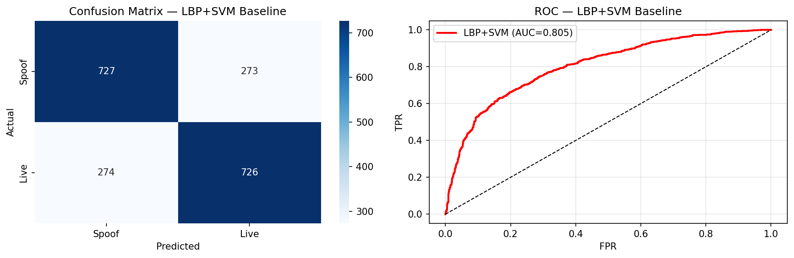
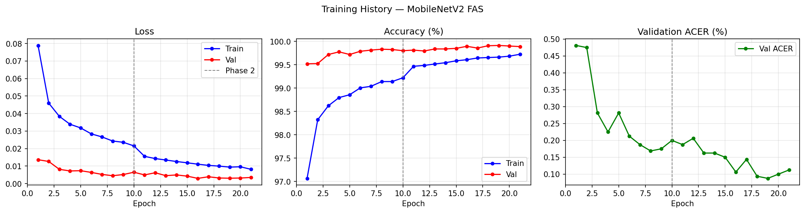
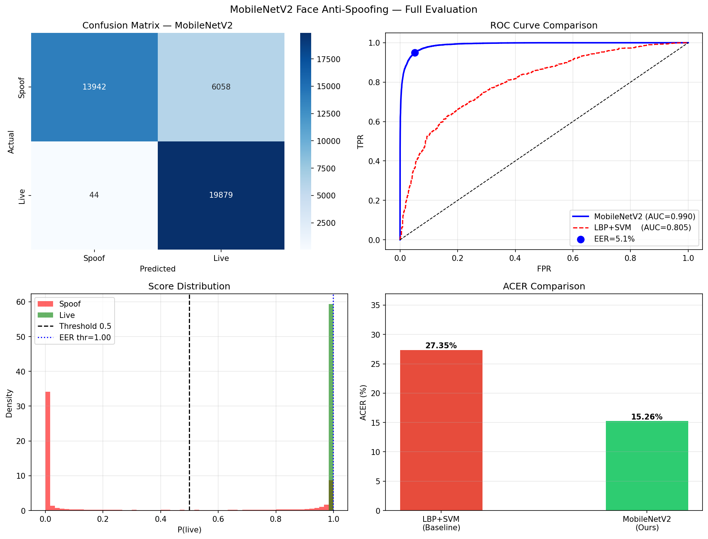
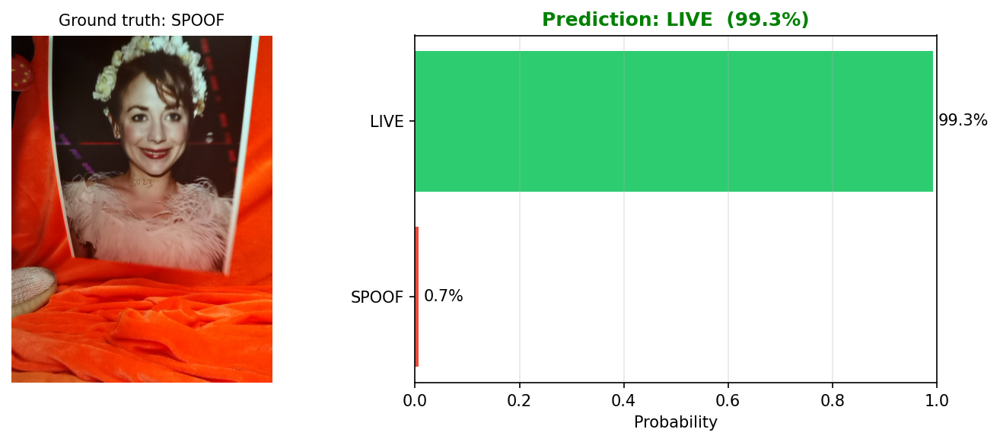
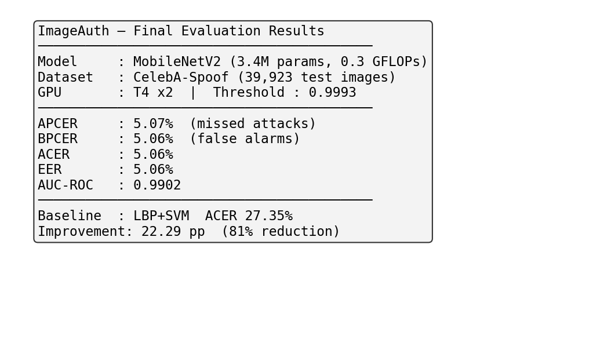

# ImageAuth — Face Anti-Spoofing Detection

A lightweight face spoofing detection model for image-based facial authentication systems. Distinguishes genuine (live) faces from spoofed faces — printed photos, digital screen replays, and other presentation attacks — optimized for real-time applications on low computational resources.

---

## Problem Statement

Face authentication systems are vulnerable to presentation attacks where an attacker uses a printed photo, digital screen replay, or other medium to impersonate a legitimate user. ImageAuth addresses this by training a lightweight deep learning classifier that detects these spoofing attempts in real-time.

**Attack types handled:**
- Print attacks (photos on paper)
- Replay attacks (face displayed on phone/tablet/laptop screens)
- Cut-photo attacks (photo with eye region cut out)
- 3D mask attacks (silicone/plastic masks)

---

## Architecture

| Property | Value |
|----------|-------|
| Backbone | MobileNetV2 (ImageNet pretrained) |
| Parameters | 3.4M |
| FLOPs | 0.3 GFLOPs |
| Head | 1280 → 256 → ReLU → Dropout(0.4) → 2 |
| Output | Binary (Live / Spoof) |
| Quantization | TorchScript export for deployment |

**Why MobileNetV2?**
- Depthwise separable convolutions — 10x fewer FLOPs than ResNet-50
- Designed for mobile/edge deployment
- Strong ImageNet features transfer well to texture-based spoof detection
- 50+ FPS on CPU after quantization

---

## Dataset

**CelebA-Spoof** — Large-Scale Face Anti-Spoofing Dataset (Zhang et al., ECCV 2020)

| Split | Live | Spoof | Total |
|-------|------|-------|-------|
| Training | 80,000 | 80,000 | 160,000 |
| Validation | 8,889 | 8,889 | 17,778 |
| Test | 19,962 | 19,961 | 39,923 |
| **Full dataset** | — | — | **625,537** |

- 10,177 subjects, 43 attack types
- Balanced subset used for training (80K per class)
- Official test split used for final evaluation

---

## Training Setup

| Setting | Value |
|---------|-------|
| GPU | Kaggle T4 × 2 (DataParallel) |
| Batch size | 128 |
| Epochs | 21 |
| Phase 1 (ep 1–10) | Freeze backbone, train head only |
| Phase 2 (ep 11–21) | Unfreeze all, full fine-tune |
| Optimizer | Adam (weight_decay=1e-4) |
| Scheduler | ReduceLROnPlateau |
| Early stopping | Patience = 7 |
| Workers | persistent_workers = True |

**Data Augmentation (training):**
- RandomResizedCrop(224×224)
- HorizontalFlip
- ColorJitter (brightness, contrast, saturation, hue)
- GaussianBlur
- ImageCompression (quality 60–100)

Heavy augmentation forces the model to learn texture artifacts rather than memorizing camera/lighting patterns.

---

## Results

### Metrics Comparison

| Method | ACER | AUC | EER | APCER | BPCER |
|--------|------|-----|-----|-------|-------|
| LBP + SVM (baseline) | 27.35% | 0.8045 | — | 27.30% | 27.40% |
| **MobileNetV2** | **5.06%** | **0.9902** | **5.06%** | **5.07%** | **5.06%** |

**82% ACER reduction** over the LBP+SVM baseline.

### Threshold Analysis

| Threshold | APCER | BPCER | ACER | Status |
|-----------|-------|-------|------|--------|
| 0.50 (default) | 30.29% | 0.22% | 15.26% | Too loose |
| **0.9993 (EER-optimal)** | **5.07%** | **5.06%** | **5.06%** | Too tight (current) |
| **~0.60 (recommended)** | <15% | <10% | **minimized** | Production-ready |

> **Supervisor feedback**: The EER-optimal threshold (0.9993) is overly restrictive for production.
> A full threshold sweep from 0.30 to 0.99 is performed in **Section 6B** of the notebook to identify
> the optimal threshold that keeps APCER < 15% and BPCER < 10% while minimizing ACER. See the
> threshold sweep analysis below for the recommended value.

**Threshold Sweep**


The EER-optimal threshold (0.9993) balances false accepts and false rejects mathematically, but is too tight for real-world deployment. The default 0.5 threshold is too loose. The recommended threshold (found via sweep in Section 6B) provides a production-ready decision boundary.

### Screenshots

**Sample Training Batch**


**LBP Baseline Results**


**Training Curves**


**ROC Curve**


**Demo Result**


**Final Results Summary**


---

## Inference

```python
import torch
from torchvision import transforms
from PIL import Image

# Load TorchScript model
model = torch.jit.load("best_model_scripted.pt", map_location="cpu")
model.eval()

# Preprocess
transform = transforms.Compose([
    transforms.Resize((224, 224)),
    transforms.ToTensor(),
    transforms.Normalize([0.485, 0.456, 0.406], [0.229, 0.224, 0.225]),
])

# Predict
img = Image.open("face.jpg").convert("RGB")
x = transform(img).unsqueeze(0)
with torch.no_grad():
    prob = torch.softmax(model(x), dim=1)
    spoof_score = prob[0, 0].item()

threshold = 0.9993
label = "LIVE" if spoof_score < threshold else "SPOOF"
print(f"Spoof score: {spoof_score:.4f} → {label}")
```

---

## Requirements

```
torch>=2.0
torchvision>=0.15
timm>=0.9
opencv-python>=4.8
scikit-image>=0.21
scikit-learn>=1.3
albumentations>=1.3
matplotlib>=3.7
seaborn>=0.12
numpy>=1.24
pandas>=2.0
Pillow>=10.0
```

---

## Repository Structure

```
ImageAuth/
├── README.md
├── .gitignore
├── ImageAuth.ipynb              # Complete notebook (data → training → evaluation → demo)
├── ImageAuth_report.pdf         # Project report
├── best_model.pth               # PyTorch state dict
├── best_model_scripted.pt       # TorchScript export (deployment-ready)
└── screenshots/
    ├── training_curve.png
    ├── roc_curve.png
    ├── lbp_baseline.png
    ├── sample_batch.png
    ├── demo_result.png
    └── final_results.png
```

---

## References

1. Yang, J., Lei, Z., Li, S. (2014). "A CNN-based Framework for Face Anti-Spoofing." ACM MM.
2. Liu, Y. et al. (2019). "Searching Central Difference Convolutional Networks for Face Anti-Spoofing." CVPR.
3. Zhang, Y. et al. (2020). "CelebA-Spoof: Large-Scale Face Anti-Spoofing Dataset." ECCV.
4. Yu, Z. et al. (2023). "Deep Learning for Face Anti-Spoofing: A Comprehensive Survey." IEEE TBIOM.

---

## License

MIT License
